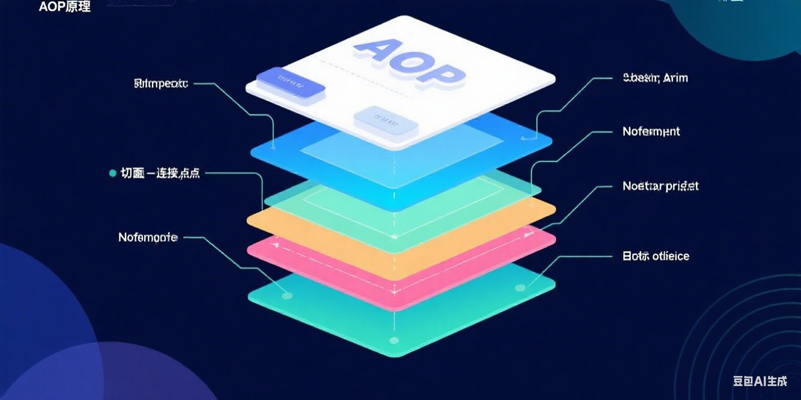
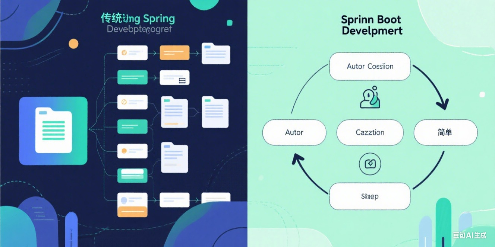
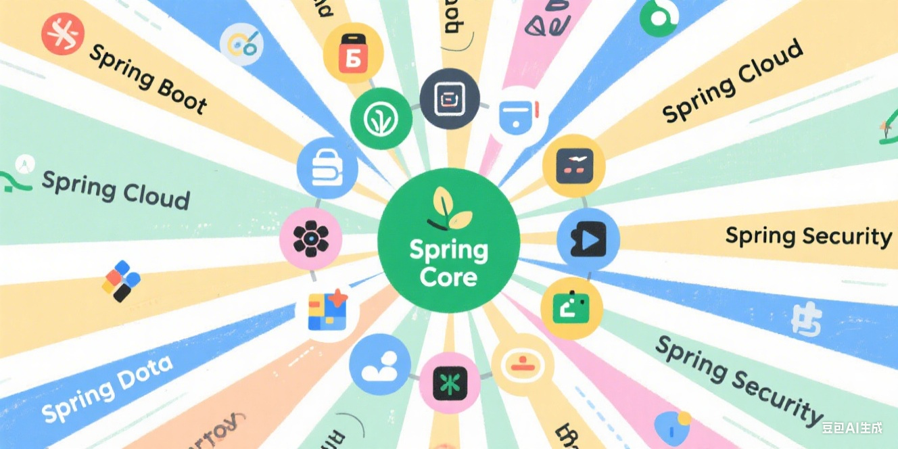

+++
date = '2025-08-04T05:05:50+08:00'
draft = false
title = 'Spring 框架详解：从入门到实战的核心指南'

+++


## 一、Spring 框架的核心优势

在 Java 开发领域，Spring 框架无疑是最具影响力的技术之一。自 2003 年首次发布以来，它彻底改变了 Java 企业级应用的开发模式，凭借其**依赖注入（DI）** 和**面向切面编程（AOP）** 两大核心特性，解决了传统 Java 开发中代码耦合度高、测试困难等痛点。

Spring 的核心优势体现在三个方面：


*   **轻量级设计**：核心容器体积小，无需依赖重型组件

*   **松耦合架构**：通过 IOC 容器实现组件间的解耦

*   **生态扩展性**：拥有完善的子项目体系，覆盖从 Web 开发到数据处理的全场景

## 二、Spring 核心模块解析

Spring 框架采用模块化设计，每个模块可独立使用，也可组合发挥最大效能。

### 2.1 Spring Core（核心容器）

这是 Spring 的基础模块，实现了 IOC 容器功能。通过**控制反转**机制，将对象的创建和依赖管理交给容器处理，开发者无需手动创建对象。


```java
// 传统方式创建对象
UserService userService = new UserServiceImpl();

// Spring IOC容器获取对象
UserService userService = context.getBean(UserService.class);
```

### 2.2 Spring AOP（面向切面编程）

AOP 允许开发者将日志记录、事务管理等横切关注点从业务逻辑中分离出来。下图展示了 AOP 的核心概念：




常见应用场景包括：


*   日志记录：方法调用前后自动记录日志

*   事务管理：声明式事务控制

*   权限校验：方法执行前验证权限

### 2.3 Spring MVC（Web 开发）

Spring MVC 是基于 MVC 模式的 Web 框架，采用**前端控制器模式**设计，核心组件包括：


*   DispatcherServlet：请求分发器

*   HandlerMapping：处理器映射

*   Controller：业务控制器

*   ViewResolver：视图解析器

## 三、Spring Boot：快速开发利器

随着 Spring 生态的发展，Spring Boot 应运而生。它通过**自动配置**和**起步依赖**，极大简化了 Spring 应用的搭建过程。




### 3.1 核心特性


*   **自动配置**：根据类路径中的依赖自动配置 Bean

*   **嵌入式服务器**：内置 Tomcat、Jetty 等服务器

*   **Starter 依赖**：简化依赖管理，如`spring-boot-starter-web`

### 3.2 快速入门示例

创建一个 RESTful 接口仅需 3 步：


1.  添加依赖：


```java
<dependency>
    <groupId>org.springframework.boot</groupId>
    <artifactId>spring-boot-starter-web</artifactId>
</dependency>
```


1.  编写主类：


```java
@SpringBootApplication
public class DemoApplication {
    public static void main(String[] args) {
        SpringApplication.run(DemoApplication.class, args);
    }
}
```


1.  实现控制器：


```java
@RestController
public class HelloController {
    @GetMapping("/hello")
    public String hello() {
        return "Hello Spring Boot!";
    }
}
```

## 四、Spring 生态系统

Spring 已形成庞大的生态体系，关键子项目包括：


*   **Spring Cloud**：微服务架构解决方案

*   **Spring Data**：数据访问统一接口

*   **Spring Security**：认证与授权框架

*   **Spring Batch**：批处理框架

*   **Spring Integration**：企业集成模式实现

## 五、最佳实践与避坑指南


1.  **依赖注入方式选择**：

*   构造器注入优先于字段注入

*   避免循环依赖

1.  **事务管理注意事项**：

*   正确设置事务传播行为

*   避免在事务方法中捕获异常

1.  **性能优化建议**：

*   合理配置 Bean 的作用域

*   开启组件扫描过滤

*   使用懒加载机制

## 六、总结

Spring 框架通过其优雅的设计理念和丰富的生态支持，成为 Java 开发的事实标准。无论是传统企业应用还是现代微服务架构，Spring 都能提供合适的解决方案。

随着 Spring 6 和 Spring Boot 3 的发布，框架引入了对 Java 17 的全面支持和虚拟线程等新特性，持续引领 Java 技术的发展方向。对于开发者而言，深入理解 Spring 的核心原理，将有助于构建更健壮、可维护的应用系统。



