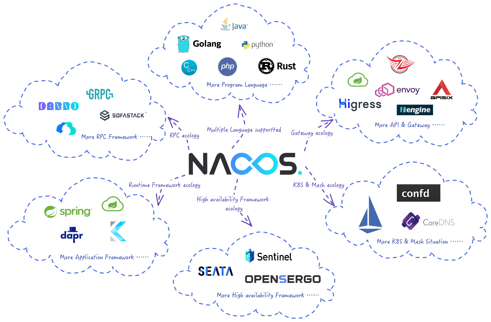

+++
date = '2025-08-01T05:05:50+08:00'
draft = false
title = '深入浅出 Spring Cloud Nacos：一站式搞定服务发现与配置管理'
categories = ["技术分享"]
tags = ["Nacos", "Spring", "Spring Cloud", "后端"]
+++



在微服务架构的浪潮中，服务的动态管理和配置的集中化成为了开发者必须面对的核心挑战。此时，Nacos 如同瑞士军刀一般，为我们提供了优雅而强大的一站式解决方案。本文将带你从零开始，深入理解 Nacos 的核心功能，并实战演示如何将其无缝集成到 Spring Cloud 项目中。

## **一、Nacos 是什么？为什么选择它？**

Nacos (Dynamic Naming and Configuration Service) 是阿里巴巴开源的一个更易于构建云原生应用的动态服务发现、配置管理和服务管理平台。简单来说，它在一个项目里同时扮演了两个关键角色：**服务注册中心** 和 **配置中心**。

选择 Nacos 的核心优势在于：
*   **功能合一**：无需再同时维护 Eureka/Consul 和 Spring Cloud Config 两套系统，Nacos 一站式搞定。
*   **灵活的模式**：同时支持 AP（高可用）和 CP（高一致性）模式，你可以根据业务场景在服务发现上灵活切换，满足不同需求。
*   **动态配置，实时生效**：修改配置后，应用无需重启即可感知变化，极大提升了运维效率。
*   **强大的控制台**：提供美观易用的可视化界面，方便我们监控服务状态、管理配置。
*   **服务健康检查**：能自动探测服务实例的健康状况，并智能地摘除不健康的实例，保障系统整体的稳定性。

## **二、Nacos 实战：集成 Spring Cloud**

接下来，我们通过一个典型的 Spring Cloud 项目，看看集成 Nacos 有多简单。

###  **2.1 作为服务注册与发现中心**

**目标**：让我们的微服务自动注册到 Nacos，并且能够互相发现。

#### **第一步：添加 Maven 依赖**
在你的 `pom.xml` 文件中，引入 `nacos-discovery` 的 starter。

```xml
<dependency>
    <groupId>com.alibaba.cloud</groupId>
    <artifactId>spring-cloud-starter-alibaba-nacos-discovery</artifactId>
</dependency>
```

#### **第二步：配置 Nacos 服务器地址**
在 `application.yml` 中，指定 Nacos 的地址。

```yaml
spring:
  application:
    # 为你的服务起一个名字
    name: order-service
  cloud:
    nacos:
      discovery:
        # Nacos Server 的地址
        server-addr: 127.0.0.1:8848
```

#### **第三步：在启动类上开启服务发现**
在 Spring Boot 的主启动类上添加 `@EnableDiscoveryClient` 注解。

```java
@SpringBootApplication
@EnableDiscoveryClient // 声明这是一个Nacos客户端
public class ServiceApplication {
    public static void main(String[] args) {
        SpringApplication.run(ServiceApplication.class, args);
    }
}
```
启动应用后，你就可以在 Nacos 控制台的 “服务管理” -> “服务列表” 中看到名为 `order-service` 的服务已经成功注册了！

### **2.2 作为统一配置中心**

**目标**：将应用的配置信息从代码中抽离，交由 Nacos 统一管理。

#### **第一步：添加 Maven 依赖**
同样，在 `pom.xml` 中引入 `nacos-config` 的 starter。

```xml
<dependency>
    <groupId>com.alibaba.cloud</groupId>
    <artifactId>spring-cloud-starter-alibaba-nacos-config</artifactId>
</dependency>
```

#### **第二步：创建 `bootstrap.yml`**
**注意**：配置中心的配置需要优先于 `application.yml` 加载，因此必须写在 `bootstrap.yml` 文件中。

```yaml
spring:
  application:
    # 同样需要指定服务名，Nacos会根据它来查找配置
    name: user-service
  cloud:
    nacos:
      config:
        server-addr: 127.0.0.1:8848
        # 指定配置文件格式
        file-extension: yaml
```

#### **第三步：在 Nacos 控制台创建配置**

1.  登录 Nacos 控制台，进入 “配置管理” -> “配置列表”。
2.  点击 “+” 号创建新配置。
3.  填写 **Data ID**： `user-service.yaml` (格式通常为 `${spring.application.name}.${file-extension}`)
4.  选择配置格式为 `YAML`。
5.  在“配置内容”中输入 ：
    ```yaml
    user:
      name: CoderWang
      age: 25
    ```
6.  点击“发布”。

#### **第四步：在代码中动态获取配置**
使用 `@Value` 注解读取配置，并添加 `@RefreshScope` 注解以支持配置的动态刷新。

```java
@RestController
@RefreshScope // 这个注解是实现配置动态刷新的关键！
public class UserController {

    @Value("${user.name}")
    private String userName;

    @GetMapping("/user/name")
    public String getUserName() {
        // 返回从Nacos获取的用户名
        return "Current user name is: " + userName;
    }
}
```
现在，启动应用并访问 `/user/name`。然后尝试在 Nacos 控制台修改 `user.name` 的值并发布，再次访问该接口，你会发现无需重启应用，返回的值已经更新了！

## **三、Nacos 进阶特性**

*   **命名空间 (Namespace)**：这是进行环境隔离的核心。你可以为 `dev`、`test`、`prod` 等不同环境创建不同的命名空间，实现配置和服务的天然隔离，非常安全。
*   **配置分组 (Group)**：当一个项目内有多种不同业务的配置时，可以使用 Group 来进行逻辑划分，使配置管理更加清晰。
*   **服务健康检查**：Nacos Client 会定期向 Server 发送心跳，告知自己“还活着”。如果 Server 长时间未收到心跳，就会将该实例标记为不健康，并从服务列表中临时剔除，从而避免流量流向已宕机的服务，实现服务调用的高可用。

## **四、总结**

Nacos 凭借其集服务发现与配置管理于一身的强大能力，以及与 Spring Cloud 生态的无缝集成，已成为构建现代化微服务架构的首选组件之一。它极大地简化了服务的治理和配置的维护，让开发者可以更专注于业务逻辑的实现。

---

