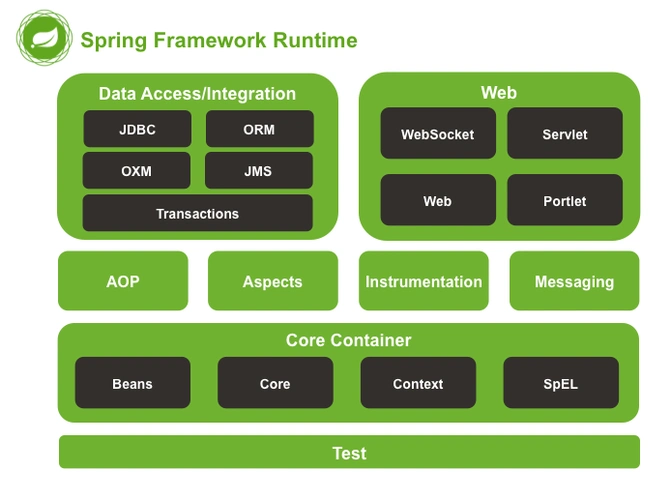
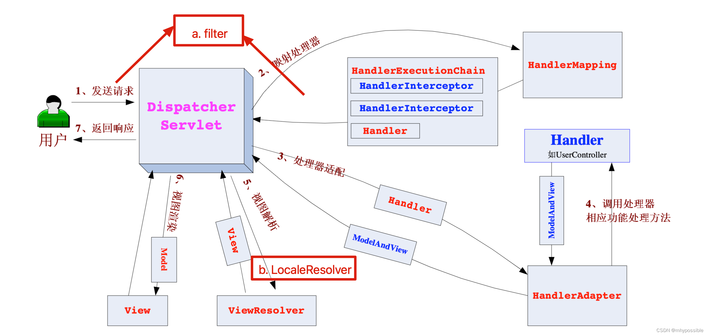
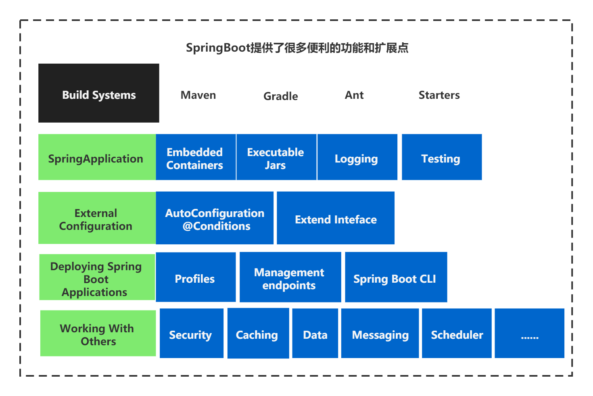
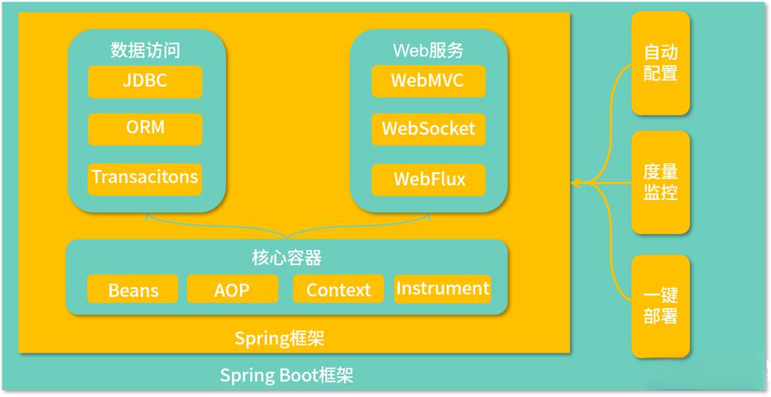

+++
title = "Spring in Depth: From Core Principles to Spring Boot Practice, A Comprehensive Guide!" 
date = 2024-10-27T10:00:00+08:00 
description = "This article will guide you to systematically sort out the core knowledge of the Spring framework, from its two fundamental pillars, IoC and AOP, to modern development tools like Spring Boot, and the vast Spring ecosystem, helping you build a complete knowledge system."
tags = ["Java", "Spring", "Spring Boot", "Backend"] 
categories = ["Technical Sharing"]
draft = false
+++



In the world of Java, if you could choose only one framework to learn, the answer would almost certainly be Spring. Since its inception in 2003, it has acted like a skilled craftsman, completely reshaping the development model of Java enterprise applications. It elegantly solves long-standing issues in traditional development such as code coupling and bloated structures, and has become the cornerstone of the Java backend development field.

This article will take you on an in-depth journey through Spring, starting from its core design philosophy, gradually exploring its key modules, modern development tools like Spring Boot, and the vast and thriving ecosystem.

## I. Why has Spring remained popular for so long? Three core advantages

The success of Spring is no accident; its core advantage lies in its adherence to an advanced design philosophy.

> The two soul foundations of Spring are: Dependency Injection (DI) and Aspect-Oriented Programming (AOP). The former is responsible for decoupling components, while the latter is responsible for separating business concerns.

This combination brings three obvious advantages:

*   An extremely loose coupling architecture: Through the Inversion of Control (IoC) container, the creation of objects and the management of dependencies are handed over to Spring. Developers are no longer the "producers" of components, but "consumers"—they just need to tell Spring "what I need," and Spring will provide it to them at the right time. This greatly reduces the coupling between code components.
*   Lightweight and Non-Invasive Design: The Spring Core container itself is very small, and more importantly, you can freely choose which part of Spring to use. Your business objects (POJOs) do not need to inherit any specific classes or implement specific interfaces, which keeps your code pure and clean.
*   Powerful Ecosystem and Extensibility: Spring has never been stagnant. It has built a vast "family set" ecosystem, covering almost all scenarios of backend development, from web development (Spring MVC), data access (Spring Data), to microservices (Spring Cloud), offering developers a "one-stop" solution.

## II. Analyzing the "Heart" of Spring: Core Module Analysis

The Spring framework is like a precise component library, where each module has its own specific role and can seamlessly collaborate with others.

### 2.1 Spring Core: The Magical Container of Inversion of Control (IoC)

This is the foundation of Spring. IoC (Inversion of Control) is a design philosophy, and Dependency Injection (DI) is its most classic implementation.

**In simple terms, IoC is like a powerful and capable housekeeper.**

In the past, if you needed a tool (object), you had to make it yourself ( `new UserServiceImpl()` ). Now, you just need to tell the housekeeper (Spring IoC container) your list of requirements, and the housekeeper will take care of preparing all the tools for you and delivering them to you when you need them.

```java
// 传统方式：主动创建对象，耦合度高
UserService userService = new UserServiceImpl();

// Spring 方式：从容器中获取，由 Spring 负责对象的生命周期
// 我们只管使用，不管创建
UserService userService = context.getBean(UserService.class);
```

### 2.2 Spring AOP: Elegant Separation of Cross-Cutting Concerns

AOP (Aspect-Oriented Programming), or aspect-oriented programming, is a powerful complement to OOP (Object-Oriented Programming). It allows us to extract "common code" that is scattered across various business logic into a separate "aspect."



This common code is known as cross-cutting concerns. The most common application scenarios include:

*   Logging: Automatically print input parameters and execution time before and after method execution.
*   Transaction Management: With a single annotation (such as `@Transactional` ), the entire method can run within a transaction.
*   Permission Check: Uniformly check user permissions before method execution.

AOP allows our business code to focus more on core logic, making it cleaner and more maintainable.

### 2.3 Spring MVC: A classic web development framework

Spring MVC is a web framework based on the MVC design pattern. It adopts the Front Controller Pattern, where all requests are first sent to a central `DispatcherServlet` for distribution, greatly simplifying web development.

The workflow of its core components working together is as follows:

1.  DispatcherServlet: Receives all requests and acts as the "overall commander" of the entire process.
2.  HandlerMapping: Finds the corresponding `Controller` (handler) based on the request URL.
3.  Controller: Handles business logic and returns a `ModelAndView` object.
4.  ViewResolver: Finds the corresponding view (such as JSP, Thymeleaf template) based on the view name returned by `Controller` .
5.  Finally, the model data is rendered onto the view and returned to the user.

## III. Spring Boot: Simplifies complexity and makes development "fly".

Although Spring is already very excellent, its cumbersome XML configuration once discouraged many developers. To solve this problem, Spring Boot was born.

> The core idea of Spring Boot is "Convention over Configuration".

It assumes the best practices for most development scenarios and sets them as default configurations. Developers no longer need to write a lot of template code, and can truly achieve "out-of-the-box" usage.



### 3.1 Core Features of Spring Boot

*   Auto-configuration: This is where the "magic" of Spring Boot lies. It automatically configures the corresponding Beans based on the dependencies you include in your project. For example, as long as you include `spring-boot-starter-web` , it will automatically configure Tomcat and Spring MVC.
*   Starter Dependencies: It packages all the dependencies required for a specific scenario into a single `starter` . For example, if you need to develop a Web application, you just need to include `spring-boot-starter-web` , and all related dependencies (such as Tomcat, Jackson, and Spring MVC) will be automatically included, completely eliminating the hassle of dependency management.
*   Embedded Server: There's no need to package the application as a WAR file and deploy it to an external Tomcat. Spring Boot includes servers like Tomcat, Jetty, and Undertow internally. You can directly package the application as an executable JAR file and start it with a single `java -jar` command.

### 3.2 Getting Started Quickly: 3 Steps to Create a RESTful Interface

Experience the elegance of simplicity in Spring Boot:

1.  Add `spring-boot-starter-web` dependency:
    
    ```xml
    <dependency>
        <groupId>org.springframework.boot</groupId>
        <artifactId>spring-boot-starter-web</artifactId>
    </dependency>
    ```
    
2.  Write a main startup class:
    
    ```java
    @SpringBootApplication // 一个注解顶过去三个
    public class DemoApplication {
        public static void main(String[] args) {
            SpringApplication.run(DemoApplication.class, args);
        }
    }
    ```
    
3.  Implement a controller:
    
    ```java
    @RestController // 声明这是一个RESTful控制器
    public class HelloController {
        @GetMapping("/hello") // 映射HTTP GET请求到 /hello 路径
        public String hello() {
            return "Hello, Spring Boot!";
        }
    }
    ```
    

启动应用，访问 `http://localhost:8080/hello`，就这么简单！ 

## IV. Spring's Full Set": The Vast Ecosystem

Spring's power goes far beyond this; its ecosystem covers almost all aspects of software development. 

*   **Spring Cloud**：The 'Swiss Army Knife' for building distributed systems and microservices architecture, offering a complete set of solutions such as service discovery, configuration center, gateway, and more.
*   Spring Data: Simplifies the development of the data access layer, allowing you to work with both relational databases (JPA) and NoSQL databases (MongoDB, Redis) using a unified and elegant Repository pattern.
*   Spring Security: Provides powerful and flexible authentication and authorization features, making it the standard choice for securing your application.
*   Spring Batch: An efficient batch processing framework for handling large volumes of data.
*   Spring Integration: Implements classic "Enterprise Integration Patterns," used for connecting different systems and applications.

## V. Pitfall Guide and Best Practices

To use Spring effectively, in addition to understanding its principles, it is also necessary to follow some best practices recognized by the community.

1.  Choosing a Dependency Injection Method:
    
    *   Prioritize constructor injection. It ensures that dependencies are ready when the object is created, avoiding issues with `NullPointerException` , and makes it easier to write unit tests. While field injection requires the least code, it is the least recommended.
2.  Avoid circular dependencies:
    
    *   A circular dependency occurs when A depends on B, and at the same time B depends on A. This is usually a sign of poor design, and should be resolved by refactoring the code, rather than relying on Spring's three-level cache to "tolerate" it.
3.  Notes on transaction management:
    
    *   The `@Transactional` annotation must be applied to a `public` method to take effect.
    *   Be cautious about the `try-catch` blocks inside transaction methods. If exceptions are "swallowed" by you, the transaction may not roll back as expected.
4.  Performance optimization suggestions:
    
    *   Use Bean scopes (Scope) appropriately. Most Beans should be singletons ( `prototype` ). For stateful Beans, carefully choose `prototype` or `request` scopes.
    *   Use the `@Lazy` annotation to implement lazy loading, delaying the initialization of non-essential Beans.

## VII. Summary and Outlook

From a lightweight container that disrupted traditional Java EE development, to today's extensive and comprehensive ecological empire, Spring has long become the de facto standard in the Java development field, thanks to its elegant design, powerful features, and active community.

With the release of Spring 6 and Spring Boot 3, the framework has fully embraced Java 17 and provided support for cutting-edge technologies such as GraalVM native images and virtual threads, continuously leading the trend in Java technology development.

For every Java developer, deeply understanding the core principles of Spring and skillfully using its ecosystem tools is undoubtedly a necessary path to enhance personal technical capabilities and build high-quality application systems.

