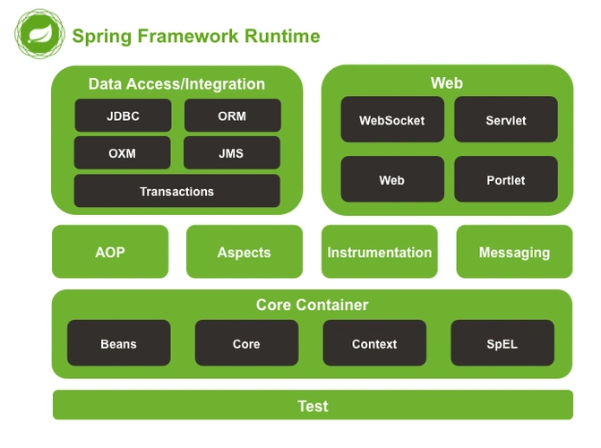
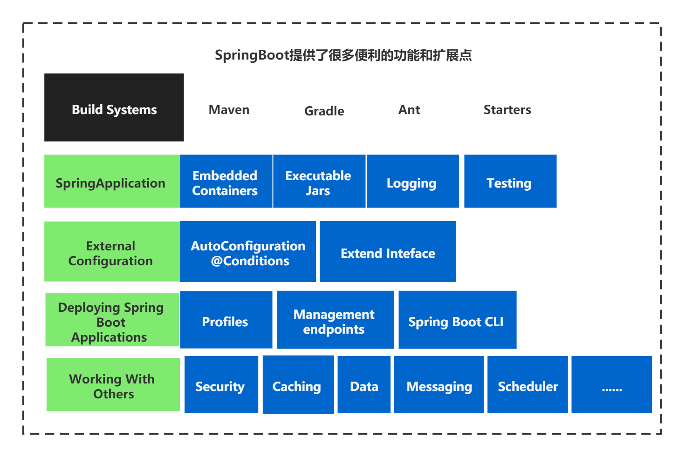

+++
title = "深入浅出 Spring：从核心原理到 Spring Boot 实战，一篇通关！"
date = 2024-10-27T10:00:00+08:00
description = "本文将带你系统性地梳理 Spring 框架的核心知识，从两大基石 IoC 和 AOP，到现代化的开发利器 Spring Boot，再到庞大的 Spring 生态，助你构建完整的知识体系。"
tags = ["Java", "Spring", "Spring Boot", "后端"]
categories = ["技术分享"]
draft = false

+++




在 Java 的世界里，如果你只选择一个框架来学习，那答案几乎毫无疑问是 **Spring**。自 2003 年诞生以来，它如同一位技艺精湛的工匠，彻底重塑了 Java 企业级应用的开发模式。它优雅地解决了传统开发中令人头疼的代码耦合、笨重臃肿等问题，成为了 Java 后端开发领域当之无愧的基石。

本文将带你进行一次 Spring 的深度之旅，从它的核心设计哲学出发，逐步探索其关键模块、现代化的开发利器 Spring Boot，以及那个庞大而繁荣的生态系统。

## 一、为何 Spring 能长盛不衰？三大核心优势

Spring 的成功并非偶然，其核心优势在于它始终遵循着一套先进的设计哲学。

> Spring 的两大灵魂基石是：**依赖注入（DI）** 和 **面向切面编程（AOP）**。前者负责解耦组件，后者负责分离业务关注点。

这套组合拳带来了三大显而易见的优势：

*   **极致的松耦合架构**：通过控制反转（IoC）容器，对象的创建和依赖关系的管理权被交给了 Spring。开发者不再是组件的“生产者”，而是“消费者”，只需告诉 Spring “我需要什么”，Spring 就会在恰当的时候提供给你。这大大降低了代码间的耦合度。
*   **轻量级与非侵入式设计**：Spring 核心容器本身非常小巧，更重要的是，你可以自由选择使用 Spring 的哪个部分。你的业务对象（POJO）无需继承任何特定的类或实现特定的接口，保持了代码的纯粹性。
*   **强大的生态与扩展性**：Spring 从未固步自封。它构建了一个庞大的“全家桶”生态，从 Web 开发（Spring MVC）、数据访问（Spring Data）到微服务（Spring Cloud），几乎覆盖了后端开发的所有场景，为开发者提供了“一站式”的解决方案。

## 二、剖析 Spring 的“心脏”：核心模块解析

Spring 框架如同一套精密的组件库，每个模块各司其职，又可无缝协作。

### 2.1 Spring Core：控制反转（IoC）的魔法容器

这是 Spring 的基础。IoC（Inversion of Control），即**控制反转**，是一种设计思想，而**依赖注入（Dependency Injection, DI）** 是其最经典的实现方式。

**简单来说，IoC 就像一个神通广大的管家。**

以前，你需要某个工具（对象），得自己去造（`new UserServiceImpl()`)。现在，你只需要告诉管家（Spring IoC 容器）你的需求清单，管家会负责帮你把所有工具准备好，并在你需要时递到你手上。

```java
// 传统方式：主动创建对象，耦合度高
UserService userService = new UserServiceImpl();

// Spring 方式：从容器中获取，由 Spring 负责对象的生命周期
// 我们只管使用，不管创建
UserService userService = context.getBean(UserService.class);
```

### 2.2 Spring AOP：优雅分离横切关注点

AOP（Aspect-Oriented Programming），即**面向切面编程**，是 OOP（面向对象编程）的有力补充。它允许我们将那些散布在各个业务逻辑中的“公共代码”抽离出来，形成一个独立的“切面”。


这些公共代码就是**横切关注点（Cross-cutting Concerns）**，最常见的应用场景包括：

*   **日志记录**：在方法执行前后自动打印出入参和耗时。
*   **事务管理**：通过一个注解（如 `@Transactional`）就能让方法整体运行在一个事务中。
*   **权限校验**：在方法执行前统一检查用户权限。

AOP 让我们的业务代码能更专注于核心逻辑，变得更加纯粹和可维护。

### 2.3 Spring MVC：经典的 Web 开发框架

Spring MVC 是一个基于 MVC 设计模式的 Web 框架，它采用**前端控制器模式（Front Controller Pattern）**，将所有请求都先交给一个核心的 `DispatcherServlet` 来分发，极大地简化了 Web 开发。

其核心组件协同工作的流程如下：
1.  **DispatcherServlet**：接收所有请求，是整个流程的“总指挥”。
2.  **HandlerMapping**：根据请求 URL 找到对应的 `Controller`（处理器）。
3.  **Controller**：处理业务逻辑，返回一个 `ModelAndView` 对象。
4.  **ViewResolver**：根据 `Controller` 返回的视图名，找到对应的视图（如 JSP, Thymeleaf 模板）。
5.  最终，将模型数据渲染到视图上，并返回给用户。

## 三、Spring Boot：化繁为简，让开发“飞”起来

尽管 Spring 已经非常优秀，但其繁琐的 XML 配置也曾劝退过不少开发者。为了解决这个问题，**Spring Boot** 横空出世。

> Spring Boot 的核心思想是 **“约定优于配置”（Convention over Configuration）**。

它假设了大多数开发场景下的最佳实践，并将其作为默认配置。开发者不再需要编写大量的模板代码，可以真正做到“开箱即用”。



### 3.1 Spring Boot 的核心特性

*   **自动配置（Auto-configuration）**：这是 Spring Boot 的“魔法”所在。它会根据你项目中引入的依赖，自动为你配置好相应的 Bean。例如，只要引入了 `spring-boot-starter-web`，它就会自动配置好 Tomcat 和 Spring MVC。
*   **起步依赖（Starter Dependencies）**：将一类场景所需的所有依赖打包成一个 `starter`。例如，你需要开发 Web 应用，只需引入 `spring-boot-starter-web`，所有相关的依赖（如 Tomcat, Jackson, Spring MVC）就都自动包含了，彻底告别了繁琐的依赖管理。
*   **内嵌式服务器**：无需再将应用打包成 WAR 包部署到外部的 Tomcat。Spring Boot 内置了 Tomcat, Jetty, Undertow 等服务器，可以直接将应用打包成一个可执行的 JAR 文件，通过 `java -jar` 命令一键启动。

### 3.2 快速入门：3 步创建 RESTful 接口

感受一下 Spring Boot 的极简之美：

1.  **添加 `spring-boot-starter-web` 依赖**：

    ```xml
    <dependency>
        <groupId>org.springframework.boot</groupId>
        <artifactId>spring-boot-starter-web</artifactId>
    </dependency>
    ```

2.  **编写一个主启动类**：

    ```java
    @SpringBootApplication // 一个注解顶过去三个
    public class DemoApplication {
        public static void main(String[] args) {
            SpringApplication.run(DemoApplication.class, args);
        }
    }
    ```

3.  **实现一个控制器**：

    ```java
    @RestController // 声明这是一个RESTful控制器
    public class HelloController {
        @GetMapping("/hello") // 映射HTTP GET请求到 /hello 路径
        public String hello() {
            return "Hello, Spring Boot!";
        }
    }
    ```
启动应用，访问 `http://localhost:8080/hello`，就这么简单！

## 四、Spring 的“全家桶”：庞大的生态系统

Spring 的强大远不止于此，它的生态系统几乎涵盖了软件开发的所有方面。

*   **Spring Cloud**：构建分布式系统和微服务架构的“瑞士军刀”，提供服务发现、配置中心、网关等全套解决方案。
*   **Spring Data**：简化数据访问层的开发，无论是关系型数据库（JPA）、NoSQL（MongoDB, Redis）都能用一套统一的、优雅的 Repository 模式来操作。
*   **Spring Security**：提供强大而灵活的认证和授权功能，是保护你应用安全的标准选择。
*   **Spring Batch**：用于处理大量数据的高效批处理框架。
*   **Spring Integration**：实现了经典的“企业集成模式”，用于连接不同的系统和应用。

## 五、避坑指南与最佳实践

要想用好 Spring，除了了解其原理，还需要遵循一些社区公认的最佳实践。

1.  **依赖注入方式选择**：
    *   **优先使用构造器注入**。它能保证依赖在对象创建时就已就绪，避免了 `NullPointerException`，也便于编写单元测试。字段注入虽然代码最少，但最不推荐。

2.  **避免循环依赖**：
    *   当 A 依赖 B，同时 B 又依赖 A 时，就会产生循环依赖。这通常是设计不良的信号，应通过重构代码来解决，而不是依赖 Spring 的三级缓存来“包容”它。

3.  **事务管理注意事项**：
    *   `@Transactional` 注解必须应用于 `public` 方法上才能生效。
    *   要警惕事务方法内部的 `try-catch` 块。如果异常被你“吃掉”了，事务可能不会按预期回滚。

4.  **性能优化建议**：
    *   合理使用 Bean 的作用域（Scope）。大部分 Bean 应该是单例（Singleton），对于有状态的 Bean 应谨慎选择 `prototype` 或 `request` 作用域。
    *   使用 `@Lazy` 注解实现懒加载，延迟非必要 Bean 的初始化。

## 六、总结与展望

从一个颠覆传统 Java EE 开发的轻量级容器，到如今枝繁叶茂、无所不包的生态帝国，Spring 凭借其优雅的设计、强大的功能和活跃的社区，早已成为 Java 开发领域的事实标准。

随着 Spring 6 和 Spring Boot 3 的发布，框架全面拥抱 Java 17，并为 GraalVM 原生镜像和虚拟线程等前沿技术提供了支持，持续引领着 Java 技术的发展潮流。

对于每一位 Java 开发者而言，深入理解 Spring 的核心原理，并熟练运用其生态工具，无疑是提升个人技术实力、构建高质量应用系统的必经之路。

