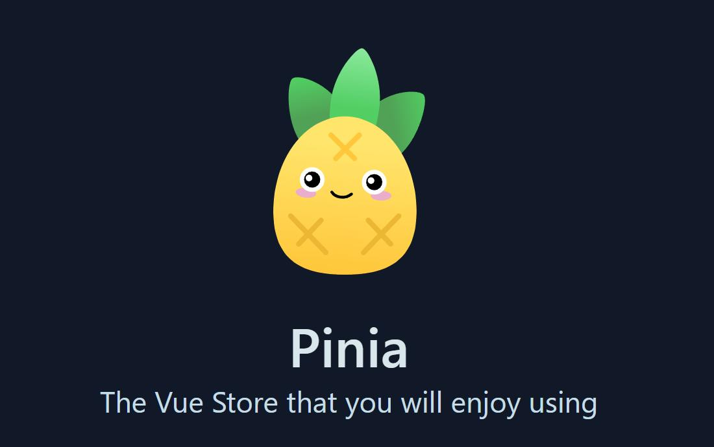

+++
date = '2025-08-03T05:05:50+08:00'
draft = false 
title = 'The Ultimate Guide to State Management in Vue 3: From Beginner to Expert with Pinia' 
categories = ["Technical Sharing"]
tags = ["Pinia", "Vue", "Frontend"] 

+++



If you're using Vue 3 and still struggling with choosing a state management solution, stop for a moment and get to know Pinia. As the next-generation alternative to Vuex, Pinia is developed by members of the Vue core team and has become the official recommended state management library for Vue 3. With its remarkable simplicity, full TypeScript support, and intuitive design philosophy, it is quickly gaining the favor of developers.

This article will guide you through a comprehensive understanding of Pinia, from core concepts to advanced techniques, helping you get started easily and unleash its full power in your projects.

## I: Why Choose Pinia? Say Goodbye to the Complexity of Vuex

Compared to Vuex, Pinia brings many exciting improvements:

*   Native TypeScript support: No need for complex type definitions, enjoy perfect auto-completion and type inference.
*   Extremely concise API: Say goodbye to `mutations` ! Actions support both synchronous and asynchronous operations, making the code more intuitive and reducing mental burden.
*   Flat module design: Each Store is a separate module, naturally possessing modularity, and calling between Stores is very simple.
*   Powerful DevTools Support: Perfectly integrated with Vue DevTools, making it easy to track state changes and perform time-travel debugging.
*   Lightweight and Efficient: Extremely small in size and highly optimized, with minimal impact on performance.

## **II. The Three Core Components of Pinia: State, Getters, Actions**

Understanding Pinia requires mastering just three core concepts. We can compare them to concepts in Vue components:

*   `state` : Equivalent to `data` of the component, it is the data source of the Store, storing the most core state.
*   `getters` : Equivalent to `computed` , is a computed property derived from `state` , and will automatically update when the dependent `state` changes.
*   `actions` : Equivalent to `methods` of the component, used to encapsulate business logic, and can modify `state` . It can handle both synchronous and asynchronous logic (such as API requests).

## **III. Getting Started with Pinia**

Let's experience the charm of Pinia through a classic counter example.

### **Step 1: Installation and Mounting**

```bash
# 使用 npm 或 yarn 安装
npm install pinia
# yarn add pinia
```

Introduce and use it in your `main.ts` (or `main.js` ).

```typescript
import { createApp } from 'vue'
import { createPinia } from 'pinia'
import App from './App.vue'

const app = createApp(App)

// 创建 Pinia 实例并挂载
app.use(createPinia())

app.mount('#app')
```

### **Step 2: Define Your First Store**

Create a `counter.ts` file under the `src/stores` directory.

```typescript
import { defineStore } from 'pinia'

// 使用 defineStore 定义一个 store
// 第一个参数是 store 的唯一 ID，Pinia 用它来连接 DevTools
export const useCounterStore = defineStore('counter', {
  // state: 定义状态的地方，必须是函数形式以避免服务端渲染的交叉请求污染
  state: () => ({
    count: 0,
    name: 'Pinia'
  }),
  
  // getters: 类似计算属性
  getters: {
    // 接收 state 作为第一个参数
    doubleCount: (state) => state.count * 2,
    
    // 也可以通过 this 访问 store 实例的其他属性，但需要显式定义返回类型
    greeting(): string {
      return `Hello, ${this.name}! My double count is ${this.doubleCount}.`
    }
  },
  
  // actions: 类似方法
  actions: {
    increment() {
      // 在 action 中可以直接通过 this 修改 state
      this.count++
    },
    async incrementAsync() {
      // 支持异步操作
      await new Promise(resolve => setTimeout(resolve, 1000))
      this.increment() // 可以直接调用其他 action
    }
  }
})
```

### **Step 3: Use it gracefully in components**

In any Vue component, you can easily call the Store.

```vue
<template>
  <div>
    <p>Count: {{ counterStore.count }}</p>
    <p>Double Count: {{ counterStore.doubleCount }}</p>
    <p>{{ counterStore.greeting }}</p>
    <button @click="counterStore.increment">Increment</button>
    <button @click="counterStore.incrementAsync">Increment Async</button>
  </div>
</template>

<script setup lang="ts">
import { useCounterStore } from './stores/counter'

// 在 setup 中调用 useStore() 函数即可获取 store 实例
const counterStore = useCounterStore()
</script>
```

## **IV Advanced Tips for Pinia**

### **4.1 Multiple Ways to Modify State**

Pinia provides multiple flexible ways to modify the state:

```typescript
// 方式1：最直接的修改
counterStore.count++

// 方式2：通过 action（推荐，便于逻辑封装）
counterStore.increment()

// 方式3：使用 $patch 批量修改（对象形式，性能更优）
counterStore.$patch({
  count: counterStore.count + 2,
  name: 'New Name'
})

// 方式4：使用 $patch 批量修改（函数形式，适用于复杂逻辑）
counterStore.$patch((state) => {
  state.count += 3
  state.name = 'Updated Name'
})
```

### **4.2 State Persistence**

Want the data to remain after the user refreshes the page? Use the `pinia-plugin-persistedstate` plugin to achieve this easily.

```bash
npm install pinia-plugin-persistedstate
```

Registering plugins in `main.ts` :

```typescript
import { createPinia } from 'pinia'
import piniaPluginPersistedstate from 'pinia-plugin-persistedstate'

const pinia = createPinia()
pinia.use(piniaPluginPersistedstate) // 注册插件
// ... app.use(pinia)
```

Enabling the `persist` option in stores that need persistence:

```typescript
export const useCounterStore = defineStore('counter', {
  state: () => ({ count: 0 }),
  // 开启持久化，默认存储在 localStorage
  persist: true
})
```

### **4.3 Communication between Stores**

In Pinia, calling between Stores is as simple as calling a regular function.

```typescript
// stores/user.ts
import { defineStore } from 'pinia'
import { useCounterStore } from './counter' // 直接引入 counter store

export const useUserStore = defineStore('user', {
  actions: {
    login() {
      console.log('User logged in!')
      // 获取 counter store 实例并调用它的 action
      const counterStore = useCounterStore()
      counterStore.increment()
    }
  }
})
```

## **V. Pinia vs. Vuex: The Ultimate Battle**

| Features | Pinia | Vuex (4.x) |
| --- | --- | --- |
| Mutations | No, Actions directly modify State | Yes, State must be modified through Mutations |
| TypeScript | Native full support, no additional configuration required | Requires complex type gymnastics and additional configuration |
| Modular | Natural modularity, each Store is a module | Needs to be configured through modules , with deeper nesting |
| Code conciseness | Very high, little template code, low mental burden | Low, many concepts, more template code |
| Vue 3 Compatibility | Perfectly fits, designed for Composition API | Good, but the design philosophy is more inclined towards Options API |

For new Vue 3 projects, the answer is clear: Pinia is a more modern, concise, and powerful choice.

## **VII. Conclusion**

Pinia truly simplifies Vue's state management with its elegant design and excellent development experience. It not only solves many pain points of Vuex, but also perfectly integrates into the Vue 3 ecosystem. If you haven't tried it yet, why not embrace Pinia in your next project? I'm sure it will surprise you.

