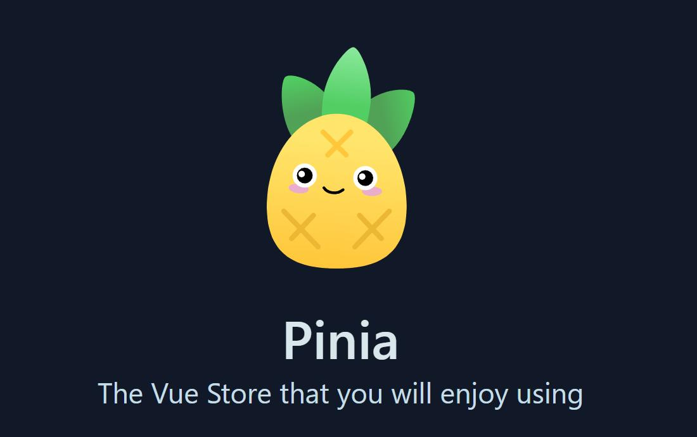

+++
date = '2025-08-03T05:05:50+08:00'
draft = false
title = 'Vue 3 状态管理终极指南：从入门到精通 Pinia'
categories = ["技术分享"]
tags = ["Pinia", "Vue", "前端"]
+++



如果你正在使用 Vue 3，并且还在纠结于状态管理方案，那么请停下脚步，认识一下 Pinia。作为 Vuex 的下一代替代者，Pinia 由 Vue 核心团队成员亲自操刀，并已成为 Vue 3 官方推荐的状态管理库。它以其惊人的简洁性、完整的 TypeScript 支持和直观的设计理念，正在迅速赢得开发者的青睐。

本文将带你全面了解 Pinia，从核心概念到高级技巧，让你轻松上手，并在项目中发挥其最大威力。

## **一、为什么选择 Pinia？告别 Vuex 的繁琐**

相比于 Vuex，Pinia 带来了许多令人振奋的改进：

*   **天生 TypeScript 支持**：无需复杂的类型定义，享受完美的自动补全和类型推断。
*   **极致简洁的 API**：告别 `mutations`！Actions 支持同步和异步操作，代码更直观，心智负担更小。
*   **扁平化的模块设计**：每个 Store 都是一个独立的模块，天然具备模块化能力，Store 之间调用非常简单。
*   **强大的 DevTools 支持**：完美集成 Vue DevTools，无论是 state 变化跟踪还是时间旅行调试，都易如反掌。
*   **轻量与高效**：体积非常小，且经过优化，对性能影响微乎其微。

## **二、Pinia 的核心三剑客：State, Getters, Actions**

理解 Pinia，只需掌握它的三个核心概念。我们可以用 Vue 组件的概念来类比：

*   **`state`**：相当于组件的 `data`，是 Store 的数据源，存储着最核心的状态。
*   **`getters`**：相当于组件的 `computed`，是基于 `state` 派生出的计算属性，当依赖的 `state` 变化时会自动更新。
*   **`actions`**：相当于组件的 `methods`，用于封装业务逻辑，可以修改 `state`。它既可以处理同步逻辑，也可以处理异步逻辑（如 API 请求）。

## **三、Pinia 快速上手**

让我们通过一个经典的计数器案例，感受 Pinia 的魅力。

### **第一步：安装与挂载**

```bash
# 使用 npm 或 yarn 安装
npm install pinia
# yarn add pinia
```

在你的 `main.ts` (或 `main.js`) 中引入并使用它。

```typescript
import { createApp } from 'vue'
import { createPinia } from 'pinia'
import App from './App.vue'

const app = createApp(App)

// 创建 Pinia 实例并挂载
app.use(createPinia())

app.mount('#app')
```

### **第二步：定义你的第一个 Store**
在 `src/stores` 目录下创建一个 `counter.ts` 文件。

```typescript
import { defineStore } from 'pinia'

// 使用 defineStore 定义一个 store
// 第一个参数是 store 的唯一 ID，Pinia 用它来连接 DevTools
export const useCounterStore = defineStore('counter', {
  // state: 定义状态的地方，必须是函数形式以避免服务端渲染的交叉请求污染
  state: () => ({
    count: 0,
    name: 'Pinia'
  }),
  
  // getters: 类似计算属性
  getters: {
    // 接收 state 作为第一个参数
    doubleCount: (state) => state.count * 2,
    
    // 也可以通过 this 访问 store 实例的其他属性，但需要显式定义返回类型
    greeting(): string {
      return `Hello, ${this.name}! My double count is ${this.doubleCount}.`
    }
  },
  
  // actions: 类似方法
  actions: {
    increment() {
      // 在 action 中可以直接通过 this 修改 state
      this.count++
    },
    async incrementAsync() {
      // 支持异步操作
      await new Promise(resolve => setTimeout(resolve, 1000))
      this.increment() // 可以直接调用其他 action
    }
  }
})
```

### **第三步：在组件中优雅地使用**
在任何 Vue 组件中，你都可以轻松地调用 Store。

```vue
<template>
  <div>
    <p>Count: {{ counterStore.count }}</p>
    <p>Double Count: {{ counterStore.doubleCount }}</p>
    <p>{{ counterStore.greeting }}</p>
    <button @click="counterStore.increment">Increment</button>
    <button @click="counterStore.incrementAsync">Increment Async</button>
  </div>
</template>

<script setup lang="ts">
import { useCounterStore } from './stores/counter'

// 在 setup 中调用 useStore() 函数即可获取 store 实例
const counterStore = useCounterStore()
</script>
```

## **四、Pinia 进阶技巧**

### **4.1 多种姿势修改 State**
Pinia 提供了多种灵活的方式来修改状态：

```typescript
// 方式1：最直接的修改
counterStore.count++

// 方式2：通过 action（推荐，便于逻辑封装）
counterStore.increment()

// 方式3：使用 $patch 批量修改（对象形式，性能更优）
counterStore.$patch({
  count: counterStore.count + 2,
  name: 'New Name'
})

// 方式4：使用 $patch 批量修改（函数形式，适用于复杂逻辑）
counterStore.$patch((state) => {
  state.count += 3
  state.name = 'Updated Name'
})
```

### **4.2 状态持久化**
想让用户刷新页面后数据依然存在？使用 `pinia-plugin-persistedstate` 插件即可轻松实现。

```bash
npm install pinia-plugin-persistedstate
```

在 `main.ts` 中注册插件：

```typescript
import { createPinia } from 'pinia'
import piniaPluginPersistedstate from 'pinia-plugin-persistedstate'

const pinia = createPinia()
pinia.use(piniaPluginPersistedstate) // 注册插件
// ... app.use(pinia)
```

在需要持久化的 Store 中开启 `persist` 选项：

```typescript
export const useCounterStore = defineStore('counter', {
  state: () => ({ count: 0 }),
  // 开启持久化，默认存储在 localStorage
  persist: true
})
```

### **4.3 Store 间的通讯**
在 Pinia 中，Store 之间的调用就跟普通函数调用一样简单。

```typescript
// stores/user.ts
import { defineStore } from 'pinia'
import { useCounterStore } from './counter' // 直接引入 counter store

export const useUserStore = defineStore('user', {
  actions: {
    login() {
      console.log('User logged in!')
      // 获取 counter store 实例并调用它的 action
      const counterStore = useCounterStore()
      counterStore.increment()
    }
  }
})
```

## **五、Pinia vs. Vuex：王者之争**

| 特性             | Pinia                                   | Vuex (4.x)                            |
| ---------------- | --------------------------------------- | ------------------------------------- |
| **Mutations**    | **无**，Actions 直接修改 State          | **有**，必须通过 Mutations 修改 State |
| **TypeScript**   | **原生完美支持**，无需额外配置          | 需要复杂的类型体操和额外配置          |
| **模块化**       | **天然模块化**，每个 Store 就是一个模块 | 需要通过 `modules` 选项配置，嵌套较深 |
| **代码简洁度**   | **极高**，模板代码少，心智负担低        | 较低，概念多，模板代码多              |
| **Vue 3 兼容性** | **完美契合**，为 Composition API 设计   | 较好，但设计理念更偏向 Options API    |

对于新的 Vue 3 项目，答案是明确的：**Pinia 是更现代、更简洁、更强大的选择**。

## **六、结语**

Pinia 以其优雅的设计和出色的开发体验，真正地简化了 Vue 的状态管理。它不仅解决了 Vuex 的许多痛点，还完美融入了 Vue 3 的生态系统。如果你还没有尝试过，不妨在下一个项目中拥抱 Pinia，相信它会给你带来惊喜。

